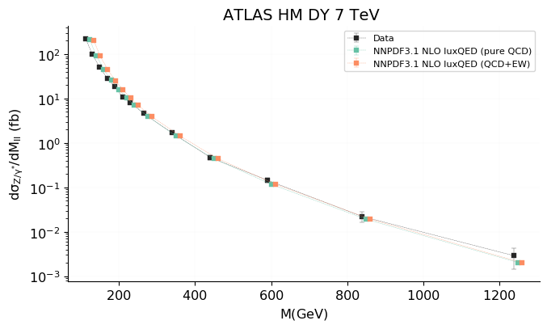
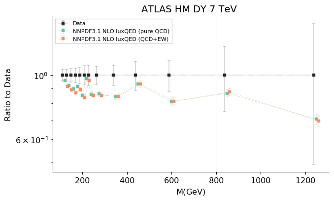
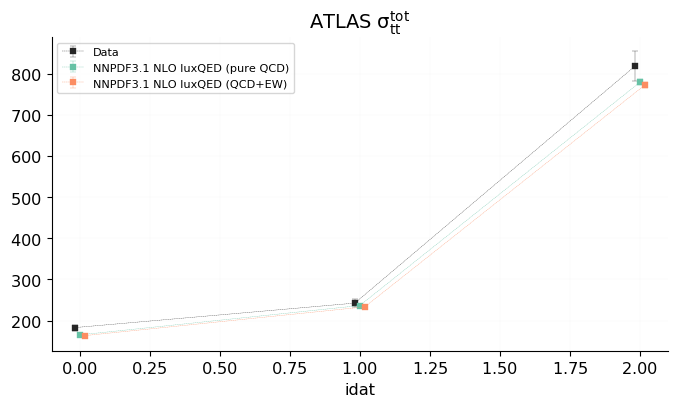
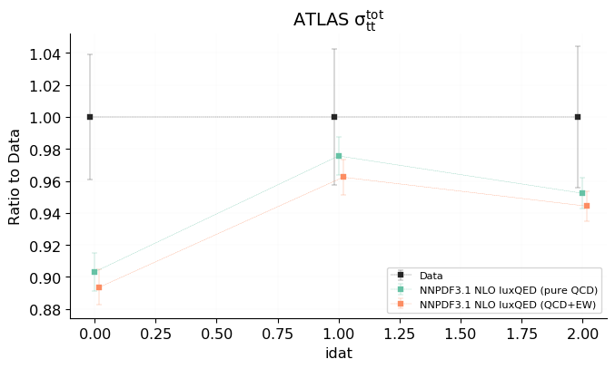
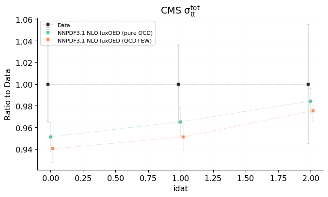

# Chi2
<table border="0" class="dataframe">
<thead>
<tr>
<th></th>
<th></th>
<th colspan="2" halign="left">NNPDF3.1 NLO luxQED (pure QCD)</th>
<th colspan="2" halign="left">NNPDF3.1 NLO luxQED (QCD+EW)</th>
</tr>
<tr>
<th></th>
<th></th>
<th>ndata</th>
<th>$\chi^2/ndata$</th>
<th>ndata</th>
<th>$\chi^2/ndata$</th>
</tr>
<tr>
<th>experiment</th>
<th></th>
<th></th>
<th></th>
<th></th>
<th></th>
</tr>
</thead>
<tbody>
<tr>
<th rowspan="4" valign="top">test</th>
<th>Total</th>
<td>19</td>
<td>1.346</td>
<td>19</td>
<td>1.487</td>
</tr>
<tr>
<th>ATLASZHIGHMASS49FB</th>
<td>13</td>
<td>1.151</td>
<td>13</td>
<td>1.036</td>
</tr>
<tr>
<th>ATLASTTBARTOT</th>
<td>3</td>
<td>2.549</td>
<td>3</td>
<td>3.271</td>
</tr>
<tr>
<th>CMSTTBARTOT</th>
<td>3</td>
<td>0.9863</td>
<td>3</td>
<td>1.654</td>
</tr>
</tbody>
</table>

# Data-prediction

 [.pdf](figures/matched_datasets_from_dataspecs0_plot_fancy_dataspecs_0.pdf)](figures/matched_datasets_from_dataspecs0_plot_fancy_dataspecs_0.png)

 [.pdf](figures/matched_datasets_from_dataspecs0_datanorm_plot_fancy_dataspecs_0.pdf)](figures/matched_datasets_from_dataspecs0_datanorm_plot_fancy_dataspecs_0.png)

 [.pdf](figures/matched_datasets_from_dataspecs1_plot_fancy_dataspecs_0.pdf)](figures/matched_datasets_from_dataspecs1_plot_fancy_dataspecs_0.png)

 [.pdf](figures/matched_datasets_from_dataspecs1_datanorm_plot_fancy_dataspecs_0.pdf)](figures/matched_datasets_from_dataspecs1_datanorm_plot_fancy_dataspecs_0.png)

 [.pdf](figures/matched_datasets_from_dataspecs2_plot_fancy_dataspecs_0.pdf)](figures/matched_datasets_from_dataspecs2_plot_fancy_dataspecs_0.png)

 [.pdf](figures/matched_datasets_from_dataspecs2_datanorm_plot_fancy_dataspecs_0.pdf)](figures/matched_datasets_from_dataspecs2_datanorm_plot_fancy_dataspecs_0.png)

